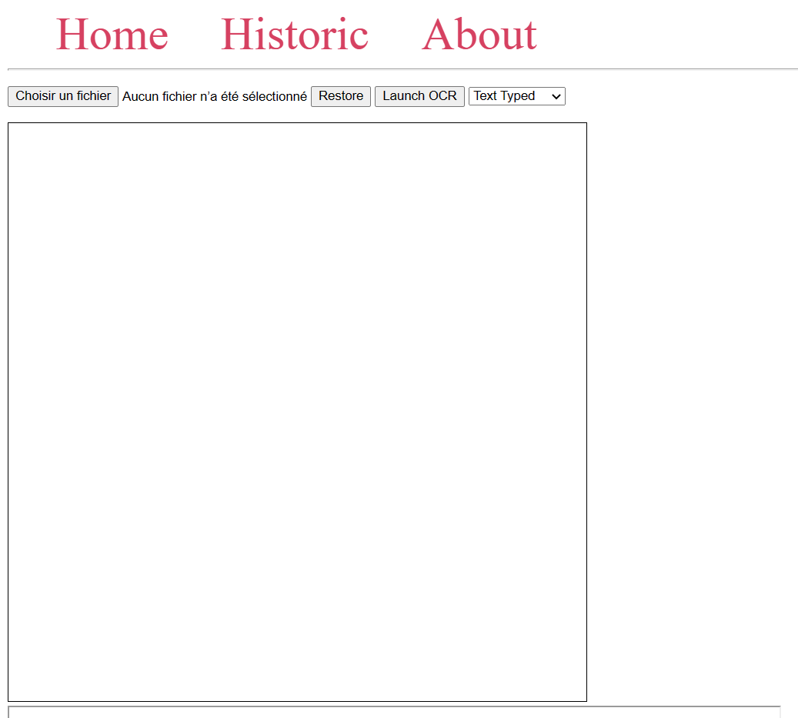
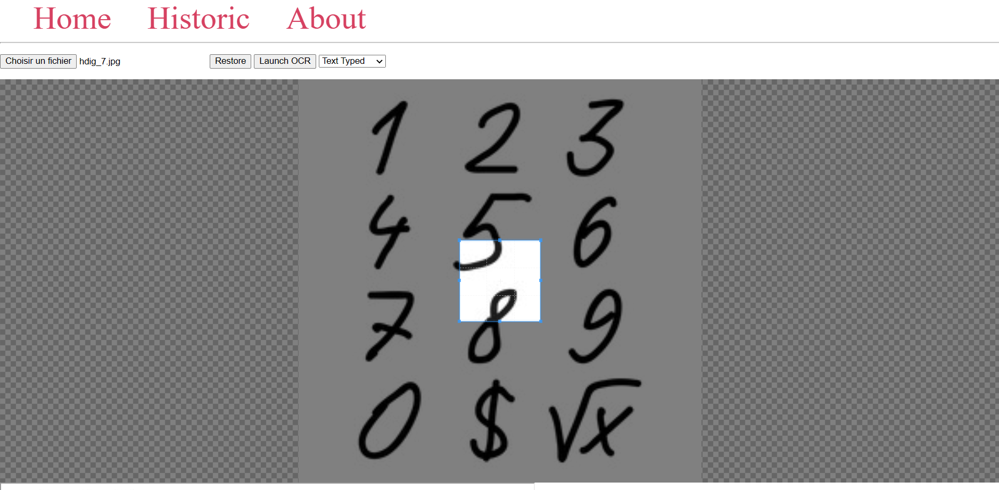
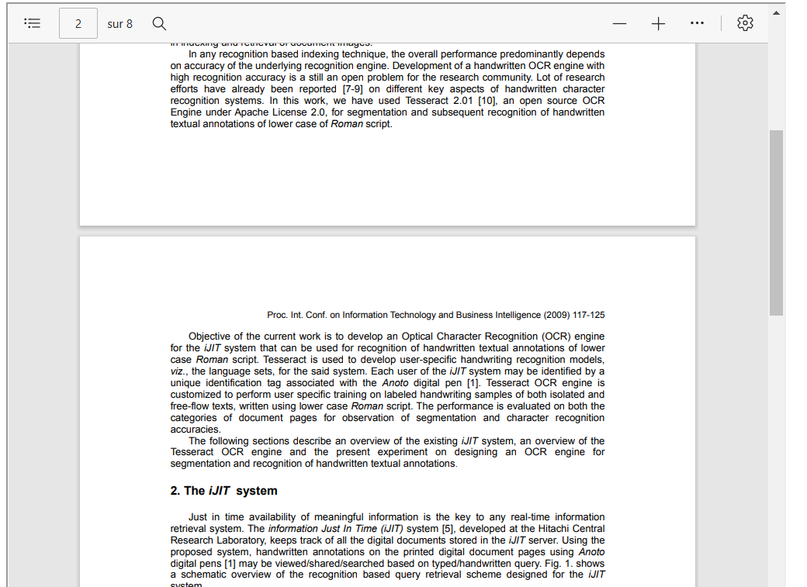
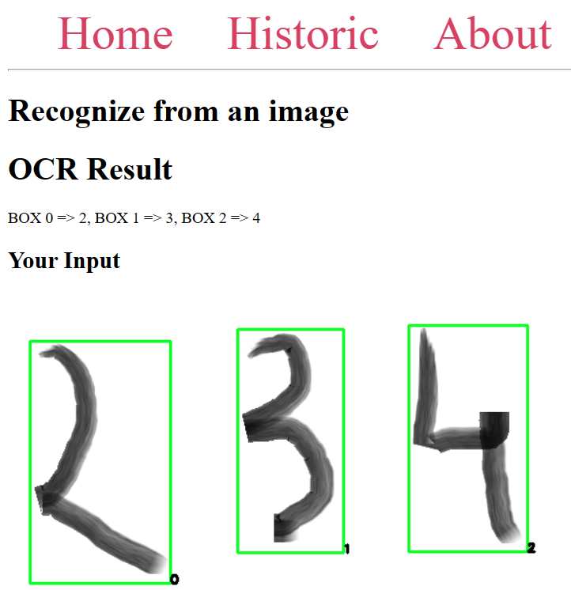
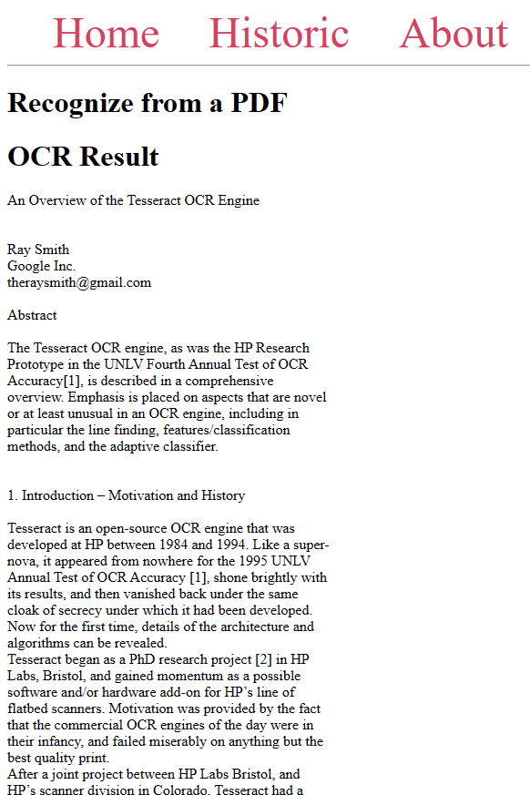
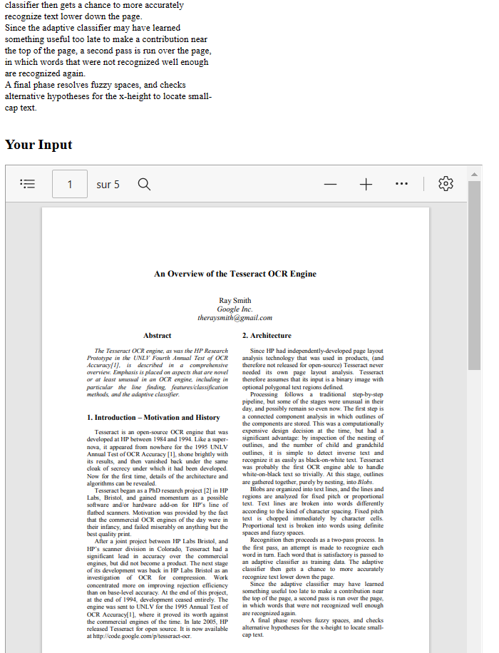

# AI_project
## Description du processus
### Explication de l'interface ( LOUIS )
L'interface aussi appelée UI dans la suite de ce document à pour but de faciliter l'utilisation de techniques de reconnaisance de caractères.

 L'OCR ou *Optical character recognition* est un terme couvrant l'ensemble des méthodes permettant d'extraire du *texte* présent dans un document. Le *texte* dans ce contexe peut autant être composé des chiffres que des lettres.  
 Nous définissons dans ce rapport un *moteur OCR* comme un système prenant un document en entrée et qui extrait le texte reconnu et le retourne dans un format exploitable par des humains ou des machines.  
 Nous avons choisi que nos moteurs OCR rentournent des string compatibles avec le format JSON pour assurer la facilité d'exploitation des résultats ainsi que leur interprétabilité par les utilisateurs. 

Notre UI est une application web, cela permet un usage aisé de la solution sur des appareils de nature différentes tel que des smartphones et des ordinateurs.

Notre application comprte 3 onglets:
- Home: l'interface de préparation du traitement du document
- Historic : présente l'historique des documents scannés
- About : renvoie vers le repository github contenant cette documentation ainsi que le code source

Nous allons nous focaliser en premier lieu sur les fonctionnalités de l'onglet *Home* visible ci-dessous.  

- Chargement d'un document :  
Nous avons un bouton en haut à gauche qui permet à l'utilisateur de sélectionner un document stocké sur son appareil.  
L'utilisateur peux soumettre une image jpeg ou png ainsi qu'un fichier pdf.  
Par contre, tous les autres types de fichiers sont bloqués pour éviter que les moteurs OCR reçoivent des données non interprétables.  
Les fichiers sont filtrés en fonction de leur extension par l'élément html pour éviter ce désagrément. 

- Affichage de l'apperçu :  
En dessous du bouton mentionné dans le paragraphe précédent nous avons deux cadres initialement vides.  
Lorsqu'un fichier est sélectionné par l'utilisateur, un des 2 cadres affichera l'apperçu du document.  
    - S'il sagit d'une image, celle-ci sera affichée tel que présenté ci-dessous.
    
    Le carré bleu montre l'image telle qu'elle sera rognée avant d'être soumise au moteur OCR. La taille et l'emplacement de cette zone est modifiable par l'utilisateur à l'aide de la souris ou de son doigt en respectant les convention classiques de manipulation de fenêtre sur son appareil. Le bouton *Restore* permet de réinitialiser les paramètres initiaux de la zone en cas de problème.

    - S'il sagit d'un pdf, celle-ci sera affiché tel que présenté ci-dessous.
    
    Nous avons accès à une lecteur de pdf assez complet qui permet de parcourir l'ensemble des pages du document ainsi que d'y rechercher des mots clés. Cependant, il n'est plus possible dans ce cas-ci de rogner seulement une partie à soumettre au moteur d'OCR à cause de la nature du format pdf qui rend les modifications compliquées pour assurer un affichage identique sur tous les appareils.

- Choix du moteur OCR :  
L'option la plus à droite de l'écran est un menu déroulant qui permet de sélectionner le moteur OCR auquel on souhaite soumettre notre document.  
Nous avons actuellement 3 moteurs à disposition:
    - Digit
    - Text Typed
    - Hand Written      
 
  Nous expliquerons leurs cas d'utilisations optimaux respectifs ainsi que leur fonctionnement dans la suite du rapport.

- Soumission du document au moteur OCR :  
Le bouton *launch OCR* envoie la requête POST vers le bon url de notre api en focntion du choix de moteur par l'utilisateur en ajoutant le document en tant que form-data pour que le traitement puisse démarrer en backend.  

### Traitement de l'entrée ( LOUIS )
Les 3 moteurs commencent par éxécuter une même foction appelée *fileUpload()*. Cette fonction s'occupe de sauvegarder le document reçu avec la requête POST dans un dossier accessible à tous les moteurs dans le backend.  
Lorsque le fichier est un pdf, la fonction sauvegarde en plus une image de chaque page du fichier pour permettre d'afficher les apperçus dans l'onglet *Historic*   

### Choix du moteur d'OCR par l'utilisateur ( LOUIS )
Notre application propose actuellement 3 moteurs : 
- Digit  
Comme son nom l'indique, c'est le moteur à privilégier pour la reconaissance de chiffres.  
Ce moteur à été concu pour lire un nombre quelquonque de chiffres manuscrits répartit sur l'ensemble du document grâce au prétraitement appliqué par le moteur avant la reconnaissance du caractère. Il est important d'avoir conscience que ce moteur à été entrainé pour reconnaitre des chiffres et non des nombres donc des chiffres collés les uns aux autres auront tendance à être mal interprétes.  

- Text Typed  
Ce moteur est à utiliser pour tous les textes dactylographiés.  
Le moteur est entrainé pour la langue anglaise mais nos tests n'ont pas remarqués de baisse d'efficacité significative lors de la soumission de documents en français.  
Le prétraitement de ce moteur sépare le texte d'éventuelles images ou autre dans le document pour améliorer la qualité du résultat obtenu.  
Il peut être utile de savoir que ce moteur est plus efficace pour reconnaitre des mots et des phrases que pour reconnaitre des caractères individuels.

- Hand Written  
Comme son nom l'indique, c'est le moteur à privilégier pour la reconaissance de caractères manuscrits.  
La qualité du résultat obtenu dépend beaucoup de la qualité du document d'entrée. Il est par exemple important de bien rogner l'image pour cibler un caractère unique sinon le moteur ne distingura probablement que des mots et tentera de les approximer par une lettre chacun.  
Il ne faut pas être trop étonné si le résultat qu'on obtient est un chiffrre car ce moteur est aussi capable de reconnaitre des chiffres manuscrits. Cependant, il est bien moins efficace que le moteur *digit* dans ce cas de figure.  

### Affichage du résultat ( LOUIS )
Le template de la page de résultat dépend du type de fichier soumis.  
- Pour une image :  
Nous affichons l'impression brute d'un dictionnaire ayant pour clé le numéro de la boundingbox et pour valeur le texte extrait de cette boundingbox.  
Nous affichons égallement en dessous une copie du document soumis sur laquelle les boundingbox ainsi que leurs numéros respectifs apparaissent.

- Pour un pdf :  
Nous affichons une version reformatée du contenu extrait. Cet affichage tient compte des retours à la ligne présents dans le résultat obtenu afin que l'affichage du contenu soit le plus fidèle possible au document original.  
Le document soumis est lui même affiché en dessous, celui-ci est à nouveau présenté dans le même type de lecteur de pdf que celui utilisé sur l'onglet *home* 

Table des matières
- Description des moteurs :
- Tesseract ( LOUIS )
### CNN mnist :
Pour le moteur de reconnaissance de chiffre manuscrit, un CNN alimenté par le dataset de mnist semblait être la meilleure solution. Nous n'avons bien évidemment pas créer de toute pièce l'architecture du CNN mais nous nous sommes inspirés d'une solution trouvée sur Kaggle : 
https://www.kaggle.com/code/abdelwahed43/handwritten-digits-recognizer-0-999-simple-model

La première étape a été de préparée les données du dataset a être traitée :
- Séparation des labels et des données associées
- Normalisation des données 
- Reshapping des données 
- Transformation des labels en classe binaires ( 1 devient par exemple 0001 ), on les sépare en dix classe différentes. Une pour chacun des chiffre 
- On transforme 10% des données d'entrainement en données de validation. Ces données de validation vont être utile durant l'entrainement afin de surveiller que le modèle ne s'habitue pas trop aux données d'entrainement.

On va ensuite définir les différentes couches de notre modéle, on expliquera par la suite ce que fait chacune des couches : 
- Conv2D, filtré 32 fois avec un kernel de 5x5
- Conv2D, filtré 32 fois avec un kernel de 5x5
- MaxPool2D, avec un pool de taille 2x2
- DropOut(0.25)
- Conv2D, filtré 64 fois avec un kernel de 3x3
- Conv2D, filtré 64 fois avec un kernel de 3x3
- MaxPool2D, avec un pool de taille 2x2
- DropOut(0.25)
- Flatten
- Dense(256,"relu")
- Dropout(0.5)
- Dense(10, "softmax")
 

Conv2D : Cette couche va nous permettre de créer un kernel qui va etre convolué avec l'input pour donner l'output. Cette couche va nous permettre de nous focaliser sur les détails de l'image. 

MaxPool2D : Cette couche va nous permettre de diminuer le nombre de paramètre sans pour autant perdre de l'information. Elle va subdiser notre input en un grand nombre de sous groupe et ne garder pour ces sous groupe que la valeur maximale. 

DropOut : Cette étape permet d'éviter l'overfitting en désactiver de manière aléatoire certains neurones durant un epoch. Un dropout de 0.25 fait en sorte que les neurones on 25 pourcents de chance de se désactiver. 

Flatten : La couche flatten va nous permettre de préparer les données à être analysé par la couhe suivante. Elle va "applatir" les données c'est à dire que l'on va passer d'un input en plusieurs dimension à un output en une seule dimension. 

Dense : Elle prend une entrée et applique une modification à l'aide de sa fonction d'activation dans ce cas-ci relu afin de nous doonée un pourcentage de chance. Elle est connecté à tous les neurones de la zone précédente. 

Le créateur du CNN a décidé d'utiliser l'algorithme RMSprop comme optimiser, l'optimiser va nous permettre de diminuer la loss en modifier le CNN. Rmsprop est un optimiser qui va utiliser un taux d'apprentissage adaptatif. Il utilise une fonction de loss de type cross-entropie, celle mesure l'écart entre la distribution de probabilité prévue du modèle et celle réelle attendue. 

Il utilise également des métrics "Accuracy", qui ont un rôle semblable à la loss, qui permettent d'évaluer le système. Dans ce cas-ci, l'évaluation ce déroule en regardant la fréquence à laquelle les prédictions du modèle correspondent aux labels réels. 

On va également utiler la fonction ReduceLROnPlateau qui va nous permettre de réduire le taux d'apprentissage du modèle lorsque celui-ci cesse de s'améliorer. Le taux d'apprentisse étant la vitesse à laquelle se met à jour le modèle durant l'entrainement. 

Pour éviter l'overfitting on a décidé de ne faire que 3 epoch, en ayant fait des tests au delà le modèle devient bien moins compétant pour les figures qu'il n'a pas eu dans son dataset. Il est trop spécialisé. 

On utilise le imageDataGenerator qui va nous permettre de nous entrainé avec des versions modifiés des images initiales. Il va les faire pivoter, zoomer mais également les shifter légèrement. 

Après avoir enregistrer ces paramètres on va pouvoir entrainer et essayer le modèle.

Lorsque l'on utilise les modèles il est important de faire en sorte de traiter les images d'input pour qu'elle correspondent à ce qui a été appris durnat l'entrainement. Il sera donc utile de les redimensionner et de modifier leur couleur. 

### CNN emnist :
Pour le moteur de reconnaissance de lettre manuscrite, un CNN alimenté par le dataset de emnist semblait être la meilleure solution. Nous n'avons bien évidemment pas créer de toute pièce l'architecture du CNN mais nous nous sommes inspirés d'une autre solution trouvée sur Kaggle : 
https://www.kaggle.com/code/achintyatripathi/emnist-letter-dataset-97-9-acc-val-acc-91-78
Malheureusement il est beaucoup moins performant que celui utilisé précédement pour mnist.

La première étape la préparation des données : 
- On va séparer les labels et les données 
- On va ensuite normaliser les données et les reshape
- Catégoriser les labels en classes binaires
- Splitter les données d'entrainement en donnée d'entrainement et de validation

On va ensuite définir les différentes couches de notre modèle :

- Conv2D, filtré 32 fois avec un kernel de 3x3
- MaxPooling2D, avec un pool de 2x2
- Flatten
- Dense(521)
- Dense(128)
- Dense(27)

 

Nous utilisons un optimiser RMSprop, avec une fonction de loss categorical_crossentropy et les mêmes metrics que pour mnist. 

On a mis en place de l'earlystoping et ReduceLROnPlateau, on a fait 5 epoch.

L'earlystopping va être utilisé pour éviter l'overfitting, il arrête l'apprentissage quand il s'apperçoit que le nombre d'erreur sur les datas de validation augmententent alors qu'ils descendent sur les datas de test. Lorsque c'est le cas le modèle commence à overfitter. 

On a ensuite entrainer le modèle et on l'a tester. Il est moins perfomant que mnist, tout d'abord le modèle comporte beaucoup moins de couche et pas de générateur d'images. De plus le sujet de emnist est beaucoup moins en vogue sur internet et nous n'avons pas su trouver de modèle plus efficace. 

### Bounding Box :
Pour la détection automatique de texte sur la page nous avons réutilisé un des principes de traitement d'image que nous avions vu en cours lors de l'année précédente. Il s'agit non pas de détection de texte mais plus de détection de "zone de couleur plus foncée", ce qui limite notre cas d'utilisation à de l'écriture blanc sur noir ou du moins foncé sur clair. 

Il va falloir traité l'image afin de détecter les zones de textes:
- On va tout d'abord lire l'image avec OpenCV
- On va ensuite la transformer en nuance de gris
- On ajoute un flou gaussien pour que les différentes zonnes soit moins distinctes et que l'on puisse trouver des mots/phrase/paragraphes entiers. 
-  Vient l'étape du treshold qui va nous permettre de "binariser" chacun des pixels de l'image, ceux-ci deviendront blanc ou noir selon l'intensité du gris
-  on va ensuite dilaté les différentes taches pour évité d'encadrer lettre par lettre. 
-  On va ensuite pouvoir dessiner des rectangles autour des différentes taches.

Maintenant que l'on connait les coordonnées de ses rectangles, nous pouvons faire des recherches directement dans l'image initiale avec nos moteurs de recherches. 

Nous avons décidé de dessiner les rectangles ainsi que de leur donnée un numéro pour que ce soit plus simple à comprendre lors de l'affichage des données. 

- Page de sortie (LOUIS)

### Historique
Nous avons décidé de sauvegarder chacun des traitements d'image dans un json afin de garder une trace de ce qui a été travailler. Il s'agit d'un historique global et il serait intéressant de penser à un historique propre dans le futur du projet. 
Pour ce faire lorsque nous avons analysé un fichier, qu'il soit pdf ou image, avant de faire un retour visuel à l'utilisateur nous le faison passer dans notre fonciton de log. 
Celle-ci va prendre en paramètres, l'emplacement du fichier traiter ainsi que le contenu qui lui est attribuer. Elle va ensuite sauvegarder dans un fichier de log :
- La date
- L'heure
- Le nom du fichier 
- L'emplacement du fichier
- Le contenu du fichier

Nous avons ensuite créer une nouvelle page dans notre frontend qui va rechercher dans ce fichier de log, les différentes données d'historique et les afficher de manière correcte avec un peu de CSS.

## Sources :
- [1] Abdelwahed43. (n.d.). Handwritten Digits Recognizer 0-999 - Simple Model. Kaggle. Retrieved January 8, 2023, from https://www.kaggle.com/code/abdelwahed43/handwritten-digits-recognizer-0-999-simple-model
- [2] Le Dropout, c'est quoi ? (n.d.). Inside Machine Learning. Retrieved January 8, 2023, from https://inside-machinelearning.com/le-dropout-cest-quoi-deep-learning-explication-rapide/
- [3] Max pooling. (n.d.). Wikipedia. Retrieved January 8, 2023, from https://fr.wikipedia.org/wiki/Max_pooling
- [4] La couche de convolution. (n.d.). Inside Machine Learning. Retrieved January 8, 2023, from https://inside-machinelearning.com/cnn-couche-de-convolution/
- [5] Prototyper un réseau de neurones avec Keras. (2019, January). Les Dieux du Code. Retrieved January 8, 2023, from https://lesdieuxducode.com/blog/2019/1/prototyper-un-reseau-de-neurones-avec-keras
- [6] What is the role of Flatten in Keras? (n.d.). Stack Overflow. Retrieved January 8, 2023, from https://stackoverflow.com/questions/43237124/what-is-the-role-of-flatten-in-keras
- [7] Modifiez votre réseau de neurones en toute simplicité. (2017, April 11). Engineering Blog. Retrieved January 8, 2023, from https://blog.engineering.publicissapient.fr/2017/04/11/tensorflow-deep-learning-episode-3-modifiez-votre-reseau-de-neurones-en-toute-simplicite/
- [8] TP: Réseau de neurones convolutionnels. (n.d.). Pensee Artificielle. Retrieved January 8, 2023, from https://penseeartificielle.fr/tp-reseau-de-neurones-convolutifs/
- [9] A Complete Guide to Adam and RMSprop Optimizer. (n.d.). Analytics Vidhya. Retrieved January 8, 2023, from https://medium.com/analytics-vidhya/a-complete-guide-to-adam-and-rmsprop-optimizer-75f4502d83be
- [10] Convolutional Neural Networks (CNN) - Softmax & CrossEntropy. (n.d.). Super Data Science. Retrieved January 8, 2023, from https://www.superdatascience.com/blogs/convolutional-neural-networks-cnn-softmax-crossentropy
- [11] Keras API Reference - Metrics - Accuracy. (n.d.). Keras. Retrieved January 8, 2023, from https://keras.io/api/metrics/accuracy_metrics/#accuracy-class
- [12] torch.optim.lr_scheduler.ReduceLROnPlateau. (n.d.). PyTorch. Retrieved January 8, 2023, from https://pytorch.org/docs/stable/generated/torch.optim.lr_scheduler.ReduceLROnPlateau.html
- [13] How to detect paragraphs in a text document image for a non-consistent text structure? (n.d.). Stack Overflow. Retrieved January 8, 2023, from https://stackoverflow.com/questions/57249273/how-to-detect-paragraphs-in-a-text-document-image-for-a-non-consistent-text-stru
- [14] Thresholding. (n.d.). OpenCV documentation. Retrieved January 8, 2023, from https://docs.opencv.org/4.x/d7/d4d/tutorial_py_thresholding.html

