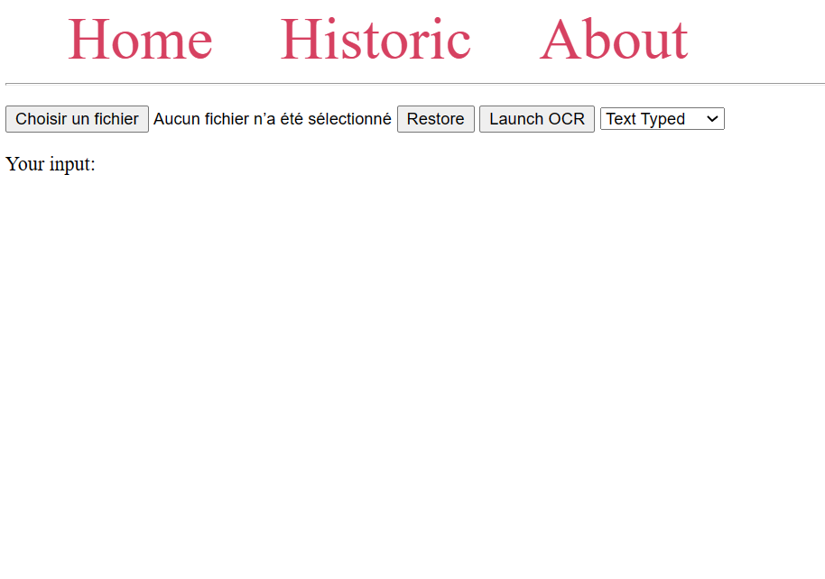

# AI_project
## Description du processus
### Explication de l'interface ( LOUIS )
L'interface aussi appelée UI dans la suite de ce document à pour but de faciliter l'utilisation de techniques de reconnaisance de caractères.

 L'OCR ou *Optical character recognition* est un terme couvrant l'ensemble des méthodes permettant d'extraire du *texte* présent dans un document. Le *texte* dans ce contexe peut autant être composé des chiffres que des lettres.  
 Nous définissons dans ce rapport un *moteur OCR* comme un système prenant un document en entrée et qui extrait le texte reconnu et le retourne dans un format exploitable par des humains ou des machines.  
 Nous avons choisi que nos moteurs OCR rentournent des string compatibles avec le format JSON pour assurer la facilité d'exploitation des résultats ainsi que leur interprétabilité par les utilisateurs. 

Notre UI est une application web, cela permet un usage aisé de la solution sur des appareils de nature différentes tel que des smartphones et des ordinateurs.

Notre application comprte 3 onglets:
- Home: l'interface de préparation du traitement du document
- Historic : présente l'historique des documents scannés
- About : renvoie vers le repository github contenant cette documentation ainsi que le code source

Nous allons nous focaliser en premier lieu sur les fonctionnalités de l'onglet *Home* visible ci-dessous.  

- Chargement d'un document :  
Nous avons un bouton en haut à gauche qui permet à l'utilisateur de sélectionner un document stocké sur son appareil.  
L'utilisateur peux soumettre une image jpeg ou png ainsi qu'un fichier pdf.  
Par contre, tous les autres types de fichiers sont bloqués pour éviter que les moteurs OCR reçoivent des données non interprétables.  
Les fichiers sont filtrés en fonction de leur extension par l'élément html pour éviter ce désagrément. 

- Affichage de l'apperçu :  
En dessous du bouton mentionné dans le paragraphe précédent nous avons deux cadres initialement vides.  
Lorsqu'un fichier est sélectionné par l'utilisateur, un des 2 cadres affichera l'apperçu du document.  
    - S'il sagit d'une image, celle-ci sera affichée tel que présenté ci-dessous.
    
    Le carré bleu montre l'image telle qu'elle sera rognée avant d'être soumise au moteur OCR. La taille et l'emplacement de cette zone est modifiable par l'utilisateur à l'aide de la souris ou de son doigt en respectant les convention classiques de manipulation de fenêtre sur son appareil. Le bouton *Restore* permet de réinitialiser les paramètres initiaux de la zone en cas de problème.

    - S'il sagit d'un pdf, celle-ci sera affiché tel que présenté ci-dessous.
    
    Nous avons accès à une lecteur de pdf assez complet qui permet de parcourir l'ensemble des pages du document ainsi que d'y rechercher des mots clés. Cependant, il n'est plus possible dans ce cas-ci de rogner seulement une partie à soumettre au moteur d'OCR à cause de la nature du format pdf qui rend les modifications compliquées pour assurer un affichage identique sur tous les appareils.

- Choix du moteur OCR :  
L'option la plus à droite de l'écran est un menu déroulant qui permet de sélectionner le moteur OCR auquel on souhaite soumettre notre document.  
Nous avons actuellement 3 moteurs à disposition:
    - Digit
    - Text Typed
    - Hand Written      
 
  Nous expliquerons leurs cas d'utilisations optimaux respectifs ainsi que leur fonctionnement dans la suite du rapport.

- Soumission du document au moteur OCR :  
Le bouton *launch OCR* envoie la requête POST vers le bon url de notre api en focntion du choix de moteur par l'utilisateur en ajoutant le document en tant que form-data pour que le traitement puisse démarrer en backend.  

### Traitement de l'entrée ( LOUIS )
Les 3 moteurs commencent par éxécuter une même foction appelée *fileUpload()*. Cette fonction s'occupe de sauvegarder le document reçu avec la requête POST dans un dossier accessible à tous les moteurs dans le backend.  
Lorsque le fichier est un pdf, la fonction sauvegarde en plus une image de chaque page du fichier pour permettre d'afficher les apperçus dans l'onglet *Historic*   

### Choix du moteur d'OCR par l'utilisateur ( LOUIS )
Notre application propose actuellement 3 moteurs : 
- Digit  
Comme son nom l'indique, c'est le moteur à privilégier pour la reconaissance de chiffres.  
Ce moteur à été concu pour lire un nombre quelquonque de chiffres manuscrits répartit sur l'ensemble du document grâce au prétraitement appliqué par le moteur avant la reconnaissance du caractère. Il est important d'avoir conscience que ce moteur à été entrainé pour reconnaitre des chiffres et non des nombres donc des chiffres collés les uns aux autres auront tendance à être mal interprétes.  

- Text Typed  
Ce moteur est à utiliser pour tous les textes dactylographiés.  
Le moteur est entrainé pour la langue anglaise mais nos tests n'ont pas remarqués de baisse d'efficacité significative lors de la soumission de documents en français.  
Le prétraitement de ce moteur sépare le texte d'éventuelles images ou autre dans le document pour améliorer la qualité du résultat obtenu.  
Il peut être utile de savoir que ce moteur est plus efficace pour reconnaitre des mots et des phrases que pour reconnaitre des caractères individuels.

- Hand Written  
Comme son nom l'indique, c'est le moteur à privilégier pour la reconaissance de caractères manuscrits.  
La qualité du résultat obtenu dépend beaucoup de la qualité du document d'entrée. Il est par exemple important de bien rogner l'image pour cibler un caractère unique sinon le moteur ne distingura probablement que des mots et tentera de les approximer par une lettre chacun.  
Il ne faut pas être trop étonné si le résultat qu'on obtient est un chiffrre car ce moteur est aussi capable de reconnaitre des chiffres manuscrits. Cependant, il est bien moins efficace que le moteur *digit* dans ce cas de figure.  

### Affichage du résultat ( LOUIS )
Le template de la page de résultat dépend du type de fichier soumis.  
- Pour une image :  
Nous affichons l'impression brute d'un dictionnaire ayant pour clé le numéro de la boundingbox et pour valeur le texte extrait de cette boundingbox.  
Nous affichons égallement en dessous une copie du document soumis sur laquelle les boundingbox ainsi que leurs numéros respectifs apparaissent.

- Pour un pdf :  
Nous affichons une version reformatée du contenu extrait. Cet affichage tient compte des retours à la ligne présents dans le résultat obtenu afin que l'affichage du contenu soit le plus fidèle possible au document original.  
Le document soumis est lui même affiché en dessous, celui-ci est à nouveau présenté dans le même type de lecteur de pdf que celui utilisé sur l'onglet *home* 

Table des matières
- Description des moteurs :
    - Tesseract ( LOUIS )
    - CNN mnist (LOGAN)
    - CNN emmnist (LOGAN)
- Bounding box (LOGAN)
- Page de sortie (LOUIS)
- Historique (LOGAN)

## Sources :
https://www.kaggle.com/code/abdelwahed43/handwritten-digits-recognizer-0-999-simple-model

